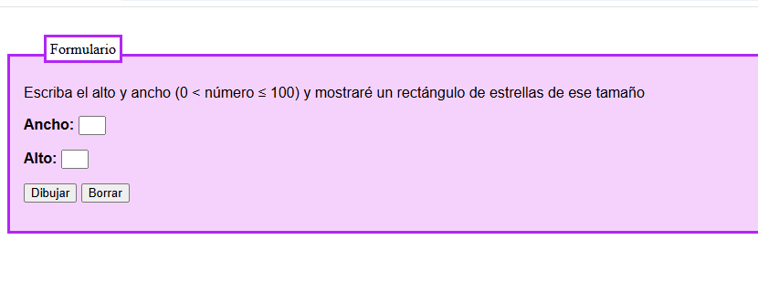
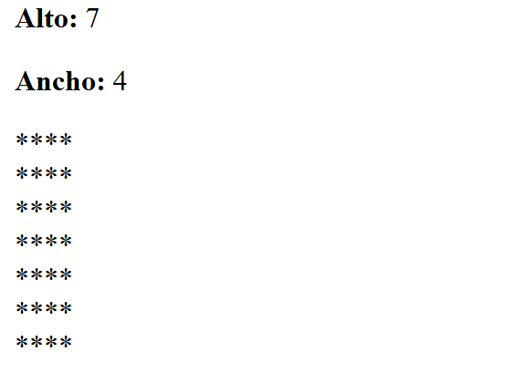
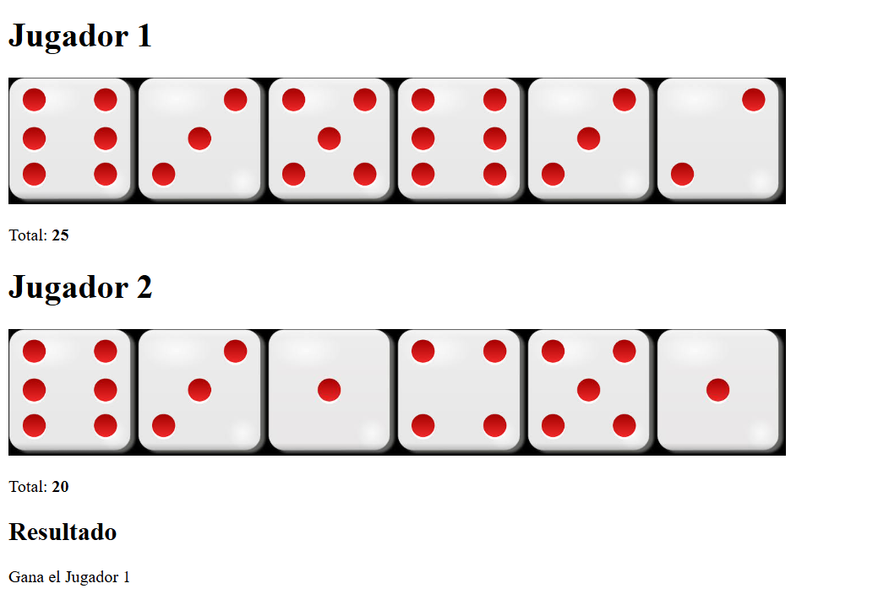
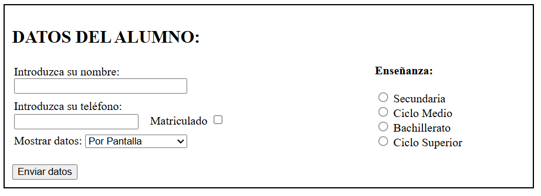
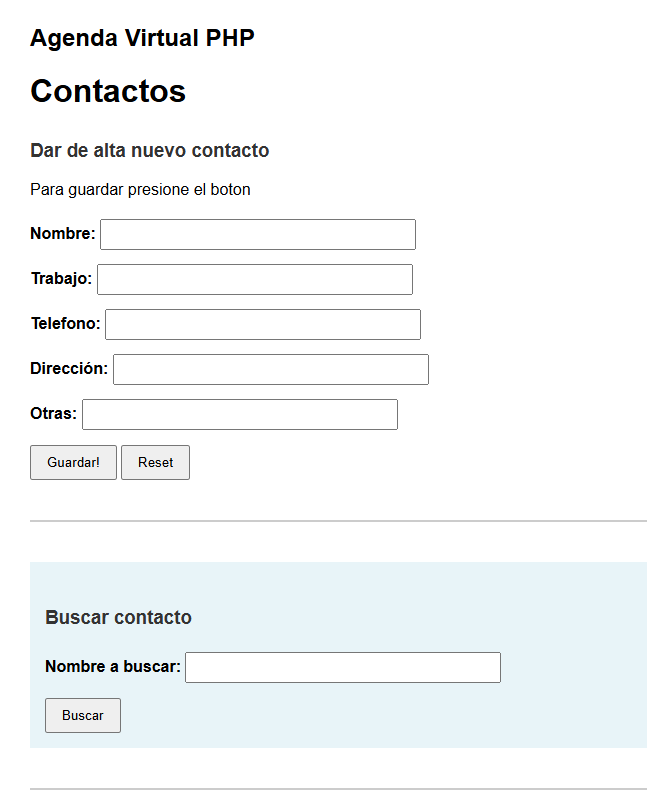

# Prácticas PHP Básico


## Descripción

Portafolio de ejercicios fundamentales en PHP diseñados para aprender y dominar los conceptos básicos de programación web del lado del servidor. Este repositorio contiene una serie de ejercicios prácticos que progresan en complejidad, comenzando con bucles y formularios básicos, hasta llegar a la creación de aplicaciones funcionales como sistemas de gestión de contactos.

Los ejercicios están enfocados en desarrollar habilidades específicas en manejo de formularios, manipulación de datos, gestión de archivos y lógica de programación.

## Tecnologías Utilizadas

- **PHP** - Lenguaje de programación del lado del servidor
- **HTML5** - Estructura y marcado
- **CSS3** - Estilos y presentación
- **File System** - Persistencia de datos mediante archivos de texto
- **Arrays** - Estructuras de datos para manipulación de información

## 📚 Ejercicios

### 🔹 Ejercicio 1: Bucles y Formularios Dinámicos

**Objetivo:** Aprender a crear formularios HTML interactivos y procesarlos con PHP utilizando bucles para generar contenido dinámico.

**Funcionalidades:**
- ✅ Formulario HTML con campos de entrada
- ✅ Procesamiento PHP mediante método POST
- ✅ Uso de estructuras `for`/`while` para salidas dinámicas
- ✅ Renderizado dinámico de patrones o tablas

**Conceptos aprendidos:**
- Bucles (for, while)
- Formularios HTML
- Métodos GET/POST
- Variables PHP

**Capturas:**




---

### 🎲 Ejercicio 2: Juego de Dados con Números Aleatorios

**Objetivo:** Desarrollar una aplicación de juego que simule el lanzamiento de dados utilizando funciones de generación de números aleatorios.

**Funcionalidades:**
- ✅ Generación aleatoria con `rand()` o `random_int()`
- ✅ Simulación de 5 dados por jugador
- ✅ Almacenamiento en arrays
- ✅ Cálculo automático de suma de dados
- ✅ Determinación del ganador o empate
- ✅ Interfaz visual con símbolos de dados

**Conceptos aprendidos:**
- Números aleatorios
- Arrays en PHP
- Operaciones matemáticas
- Lógica condicional

**Capturas:**



---

### 👨‍🎓 Ejercicio 3: Sistema de Registro de Alumnos con Persistencia

**Objetivo:** Crear un sistema completo de registro de estudiantes con almacenamiento persistente en archivos de texto.

**Funcionalidades:**
- ✅ Formulario complejo (`alumno.html`) con múltiples tipos de inputs:
  - Campos de texto (nombre, teléfono)
  - Checkbox de matrícula
  - Select de tipo de enseñanza
  - Radio buttons para elegir salida
- ✅ Procesamiento condicional (`datos_alumno.php`)
- ✅ Escritura en archivos con `fopen()`, `fwrite()`, `fclose()`
- ✅ Lectura de archivos (`mostrardatos.php`)
- ✅ Navegación entre páginas
- ✅ Validación de datos

**Conceptos aprendidos:**
- Manejo de archivos
- Inputs múltiples (checkbox, select, radio)
- Persistencia de datos
- Flujo multi-página

**Ejemplo de salida:**
```
El alumno Felipe Ríos Vázquez, con teléfono 955979999, está matriculado en un ciclo superior
```

**Capturas:**



---

### 📇 Ejercicio 4: Agenda de Contactos Completa (CRUD)

**Objetivo:** Desarrollar una aplicación completa de gestión de contactos implementando operaciones CRUD (Create, Read, Update, Delete).

**Funcionalidades principales:**
- ✅ **Listar Contactos:** Visualización en formato tabla/tarjetas
- ✅ **Alta de Contactos:** Formulario con nombre, teléfono, email, dirección
- ✅ **Búsqueda:** Sistema de filtrado por nombre u otros criterios
- ✅ **Detalle Individual:** Vista detallada de cada contacto
- ✅ **Almacenamiento:** Persistencia en archivo de texto estructurado
- ✅ **Interfaz Intuitiva:** Navegación clara entre funcionalidades

**Conceptos aprendidos:**
- Operaciones CRUD
- Búsqueda y filtrado
- Arquitectura de aplicación
- Gestión de datos

**Arquitectura técnica:**
- **Estructura modular:** Archivos separados (`listado.php`, `agregar.php`, `buscar.php`, `detalle.php`)
- **Gestión de datos:** Arrays asociativos y funciones de archivo
- **Validación:** Cliente (HTML5) y servidor (PHP)

**Capturas:**



## 🚀 Instalación y Uso

1. **Clonar el repositorio:**
```bash
git clone https://github.com/tu-usuario/php-basico-practicas.git
cd php-basico-practicas
```

2. **Requisitos:**
   - PHP 7.4 o superior
   - Servidor web (Apache/Nginx) o PHP built-in server
   - Permisos de escritura para archivos de datos

3. **Ejecutar con PHP built-in server:**
```bash
php -S localhost:8000
```

4. **Acceder desde el navegador:**
```
http://localhost:8000
```

## 📁 Estructura del Proyecto

```
php-basico-practicas/
│
├── ejercicio1/
│   ├── formulario.html
│   └── procesar.php
│
├── ejercicio2/
│   └── dados.php
│
├── ejercicio3/
│   ├── alumno.html
│   ├── datos_alumno.php
│   ├── mostrardatos.php
│   └── datos.txt
│
├── ejercicio4/
│   ├── listado.php
│   ├── agregar.php
│   ├── buscar.php
│   ├── detalle.php
│   └── contactos.txt
│
├── img/
│   ├── 1.png
│   ├── 2.png
│   ├── 3.png
│   ├── 4.png
│   └── 5.png
│
└── README.md
```

## 🎯 Objetivos de Aprendizaje

Al completar estos ejercicios, habrás aprendido:

- ✨ Fundamentos de PHP
- 🔄 Estructuras de control (bucles, condicionales)
- 📋 Procesamiento de formularios
- 🎲 Generación de números aleatorios
- 📂 Manejo de archivos (lectura/escritura)
- 🗃️ Trabajo con arrays
- 🏗️ Arquitectura de aplicaciones web
- ✅ Validación de datos
- 🔍 Operaciones CRUD básicas

## 🤝 Contribuciones

Las contribuciones son bienvenidas. Si deseas mejorar algún ejercicio o agregar nuevos:

1. Fork el proyecto
2. Crea una rama para tu feature (`git checkout -b feature/mejora`)
3. Commit tus cambios (`git commit -m 'Agrega nueva funcionalidad'`)
4. Push a la rama (`git push origin feature/mejora`)
5. Abre un Pull Request

## 📄 Licencia

Este proyecto está bajo la Licencia MIT. Consulta el archivo `LICENSE` para más detalles.

## 📧 Contacto

Si tienes preguntas o sugerencias, no dudes en abrir un issue o contactarme.

---

⭐ **¡Si este proyecto te fue útil, considera darle una estrella!** ⭐
